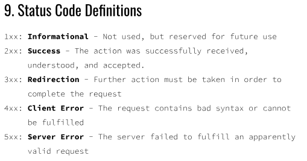
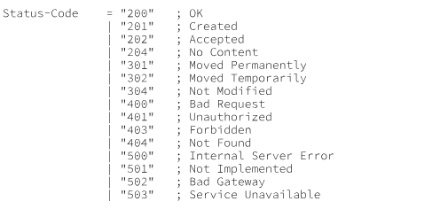
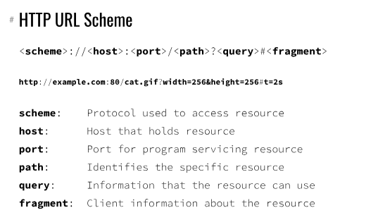
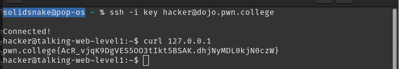
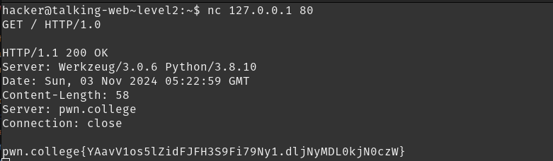

## Talking Web
 
- HTTP: hyper text transfer protocol
- it is used to send or receive data from the web to the user
- GET : requests data from the server [ like loading a webpage]
- POST : Sends data to a server [like submitting a form]
- PUT and DELETE : Used for modifying or deleting data on a server
- HTTPS : adds a layer of encryption for the secure data transfer
- RFC [request for commands]: it is documentation that describes the specifications for protocols
- request line:  ; `GET / HTTP/1.0`
- 
- 
- full http request
```
    GET /greet HTTP/1.0
    HOST: hello.example.com
```
- full htto response: GET
```
    HTTP/1.0 200 OK
    Content-Type: text/html;charset=UTF-8
    Content-Length: 39
    <html><body>Hello World</body><html>
```
- 

## level 1
- curl: it is used to transfer data from or to a server using various network protocols like http , https tcp etc
- `curl example.com`: outputs the content of the page
- solution: 

## level 2
- netcat [nc] : sed in networking tasks like port scanning, sending files, creating network connections, and testing services.
- here I want to send a http request to localhost using nc
- `nc 127.0.0.1 80` to try to make a connection to the localhost at port 80 which is http
- then I do a get request `GET / HTTP/1.0`
- solution: 

## level 3
- 