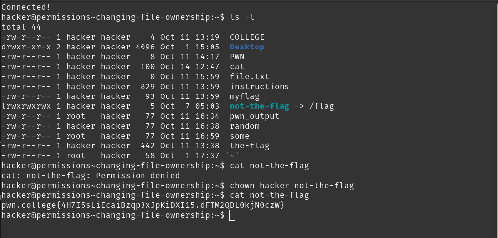

# Task-phase writeup

## Challenge-1 Name: perceiving permissions
- `chown` command can be used to change the owner of a file, this command can only be used by the root user
- solution: 

## Challenge-2 Name: groups and files
- each file and directory in linux has both an owner and group.
- group decides which user can access the file or modify it.
- `chgrp ` : to change the group of the file.
- solution: 

## Challenge-3 Name: fun with groups names
- id : can be used to figure out which grp you are in
- solution: 

## Challenge-4 Name: changing permissions
- `r`- user/group/other can read the file (or list the directory)
- `w` - user/group/other can modify the files (or create/delete files in the directory)
- `x `- user/group/other can execute the file as a program (or can enter the directory, e.g., using `cd`)
- `-` - nothing 
- `chmod [OPTIONS] MODE FILE` : tp change the mod of files
- solution' : 

## Challenge-5 Name: executable files
- `chmod u+x name_of_executable` gives permission to the user to execute the program
- solution: 

## Challenge-6 Name: Permission Tweaking Practice
- solution: change the permissions of `/challenge/pwn` for 8 rounds then change the permission of `/flag` using `chmod`.

## Challenge-7 Name: Permission setting practice
- `u=rw` sets read and write permissions for the user, and wipes the execute permission
- `o=x` sets only executable permissions for the world, wiping read and write
- `a=rwx` sets read, write, and executable permissions for the user, group, and world!
- you can zero out permissions with `-`
- solution: change the permissions of `/challenge/pwn` for 8 rounds then change the permission of `/flag` using `chmod`

## Challenge-8 Name: The SUID BIT
- SUID :is a special permission bit in Linux that, when set on an executable file, allows users to run that file with the permissions of the file's owner 
- this is how to use it: `chmod u+s file_name` 
- solution : 
