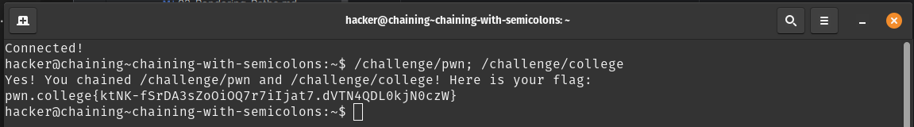
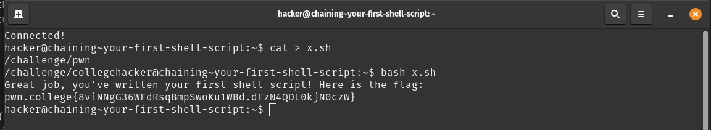
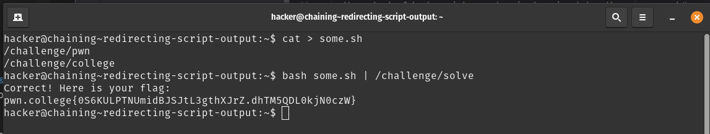
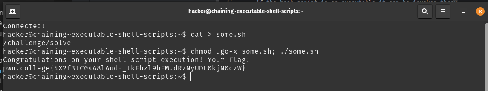

# Task-phase writeup

## Challenge-1 Name: chaining with semicolons
- `; `: can be used to chain commands
- solution : 

## Challenge-2 Name: your first shell script
- you can create shell scripts with `cat > name.sh` and `bash name.sh` to execute it.
- solution: 

## Challenge-3 Name: redirecting script output
- the output of bash scripts can be piped as input to other commands
- solution : 

## Challenge-4 Name: executable shell scripts
- if the bash script is an executable it can be invoked through its relative or absolute path
- solution: 