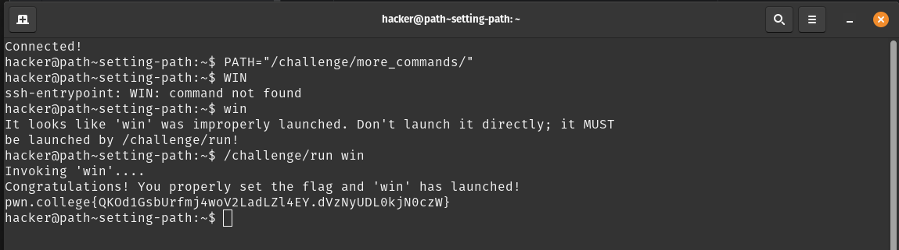
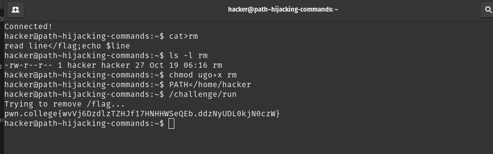

# Task-phase writeup

## Challenge-1 Name: the path variable
- PATH variable : contains a colon-separated list of directories where the shell looks for executables.
- you can blank it out with `PATH=""`
- solution : 

## Challenge-2 Name: setting path
- by adding directories to or replacing directories in the PATH you can expose programs to be launched using their bare name
- solution: 

## Challenge-3 Name: Adding Commands
- solution : in this path variable should be updated to shell script win , which should be able to give the flag
- the shell script contains `read line </flag;echo $line` which reads a line from /flag, stores it in variable line and prints it
- 

## Challenge-4 Name: Hijacking Commands
- the only way to solve this is to trick the /challenge/run program to run our bash script instead of rm to give the flag
- therefore , create a bash script to read the line from /flag and print the line for eg: `read line</flag;echo $line`
- then change the permissions of the sh file for /challenge/run to execute it `chmod ugo+x rm`
- then finally change the path to home/hacker so it's the only place the program can search for rm
- solution: 