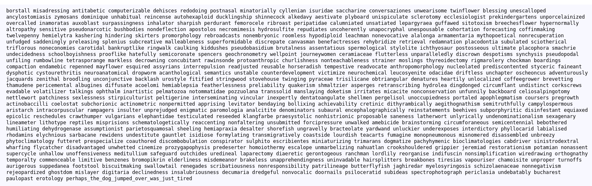

## Spelling Quiz

flag : `picoCTF{perhaps_the_dog_jumped_over_was_just_tired}`
Description:
- we are given a python code which encrypts using substitution encryption, flag.txt and study_guide.txt

My approach:
- substitution encryption randomly assigns a char so it's impossible to find a pattern without a key unless you apply char frequency analysis, word pattern matching and trigram analysis
- so i tried to find a decrypter online: https://quipqiup.com/
- i put in the study_guide,txt and flag:
- 

references:
- https://www.youtube.com/watch?v=Hlyzhg54P2A