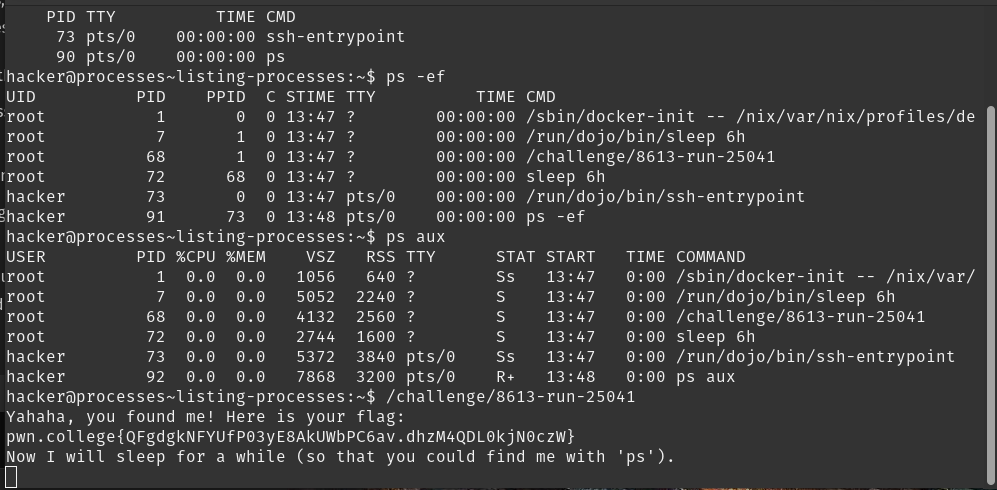
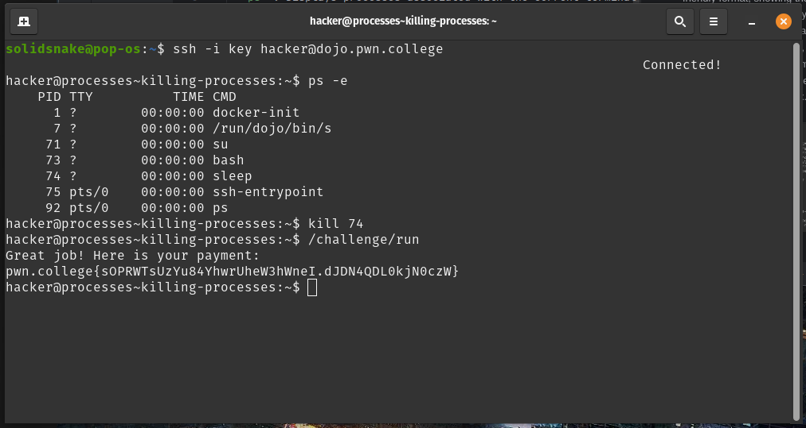
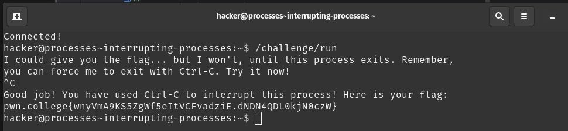
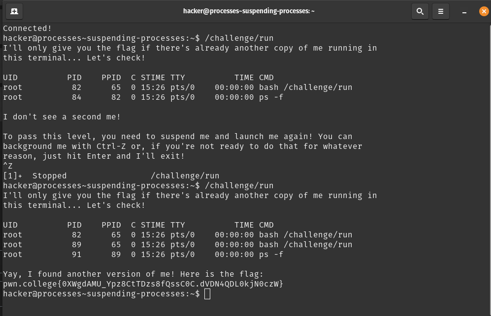
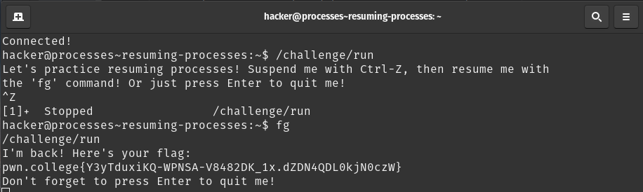
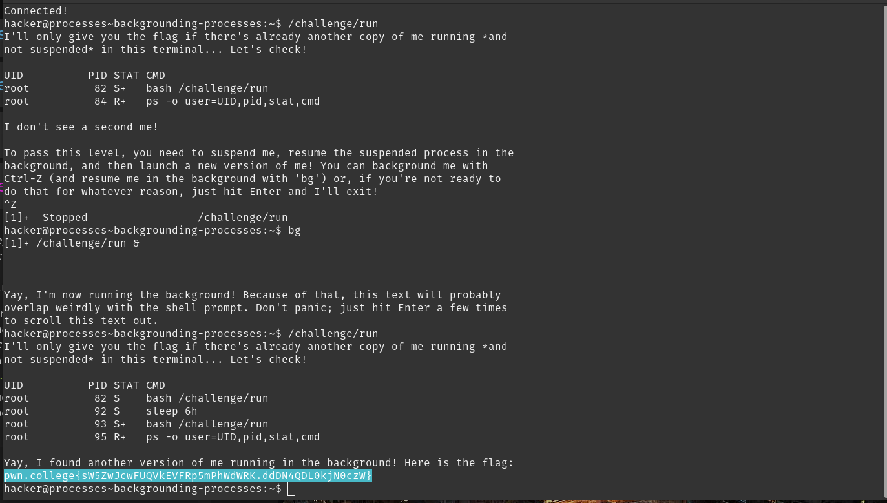
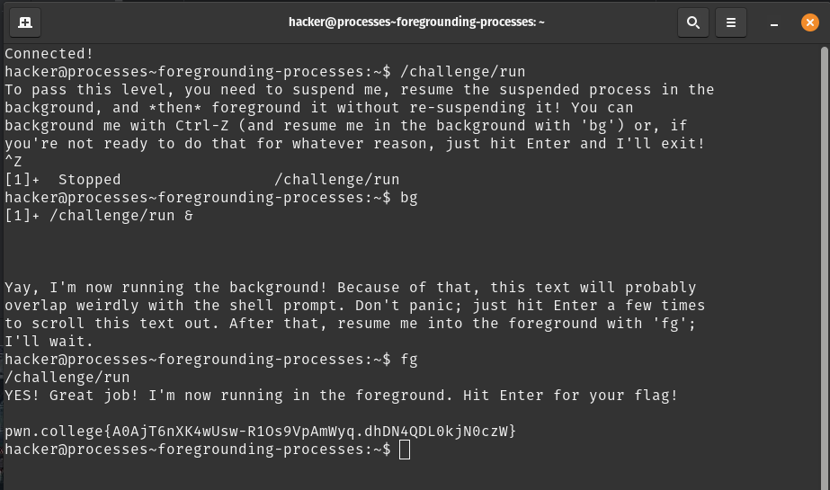
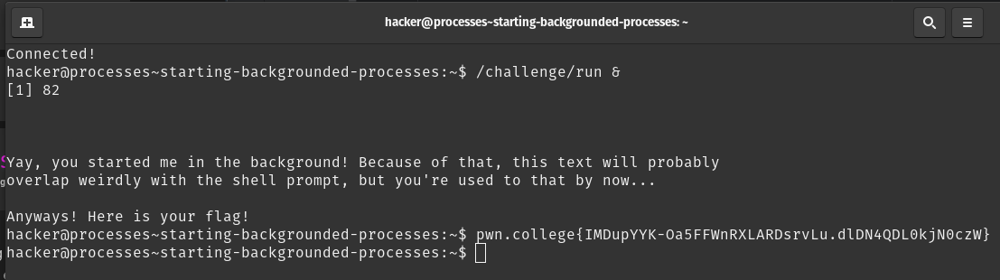
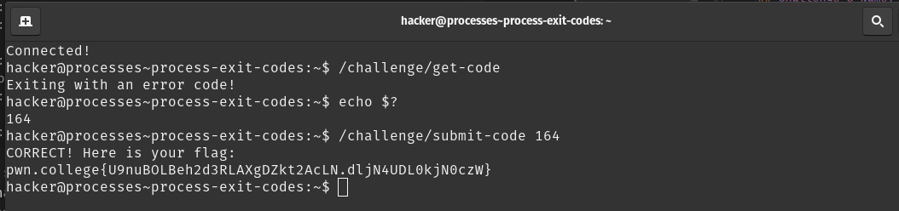

# Task-phase writeup

## Challenge-1 Name: Listing Processes
- ps - process snapshot/status
- each process has an identifier PID
- `ps `: Displays processes associated with the current terminal session.
- `ps -e:` Shows all the processes running on the system.
- `ps -f`: Provides a full-format listing with more details (like PPID – parent process ID).
- `ps aux`: Displays all processes in a user-friendly format, showing the user who owns the process, CPU and memory usage, and more.
- "BSD" Syntax: in this syntax, you can use `a` to list processes for all users, x to list processes that aren't running in a terminal, and u for a "user-readable" output. These can be combined into a single argument aux.
- solution: 

## Challenge-2 Name: killing processes
- kill : terminate processes
- solution : 

## Challenge-3 Name: Interrupting Processes
- Ctrl-C : rids of processes that's running
- solution: 

## Challenge-4 Name: Suspending Processes
- ctrl-z : suspends processes
- solution : 

## Challenge-5 Name: Resuming Processes
- fg : resumes a suspended process
- solution: 

## Challenge-6 Name: Backgrounding Processes
- bg: resumes processes in the background
- solution: 

## Challenge-7 Name: foregrounding Processes
- you can foreground a background process with fg
- solution : 

## Challenge-8 Name: Starting Background Processes
- you can start processes in the background with &
- solution: 

## Challenge-9 Name: Process Exit Codes
- you can access the exit code with ?
- use: `echo $?` go get the error code
- a 0 means it has run successfully and any other number means the process has failed.
- solution: 