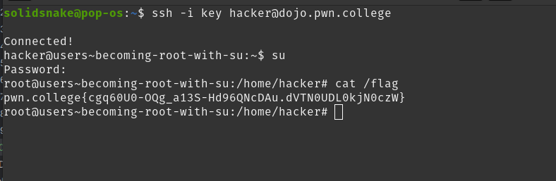
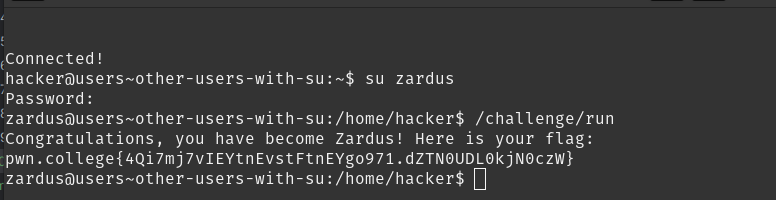
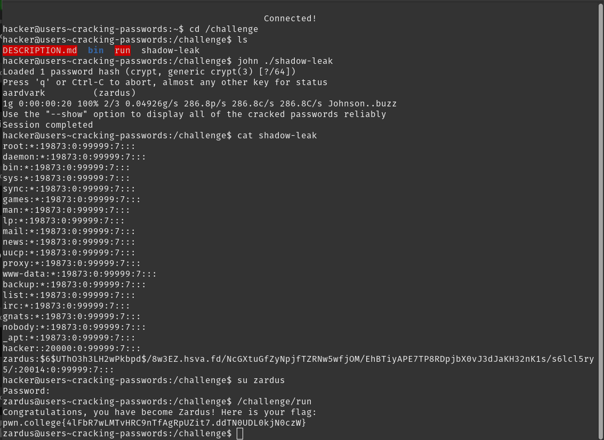
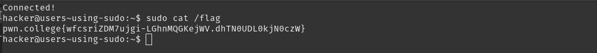

# Task-phase writeup

## Challenge-1 Name: becoming root with su
- su switches to the root user [with the password]
- solution: 

## Challenge-2 Name: other users with su
- `su username` : to become a different user [with the password]
- solution: 

## Challenge-3 Name: Cracking passwords
- john the ripper: used to crack hashed password formats
- solution : 

## Challenge-4 Name: sudo
- sudo : allows a permitted user to run a command as another user who has elevated privileges.
- solution : 

