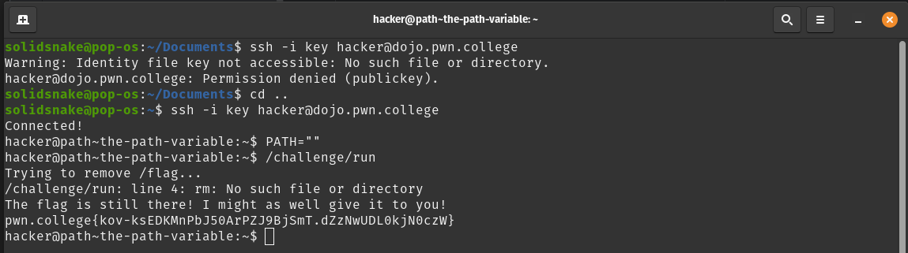
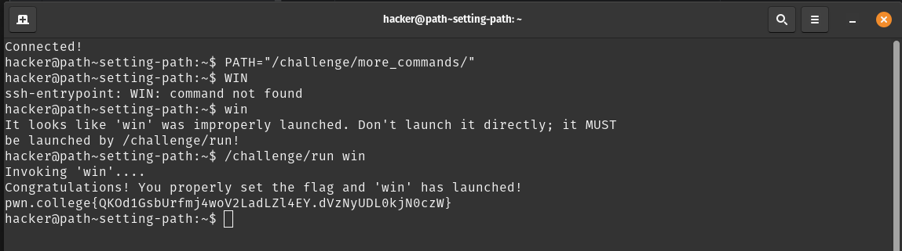

# Task-phase writeup

## Challenge-1 Name: the path variable
- PATH variable : contains a colon-separated list of directories where the shell looks for executables.
- you can blank it out with `PATH=""`
- solution : 

## Challenge-2 Name: setting path
- by adding directories to or replacing directories in the PATH you can expose programs to be launched using their bare name
- solution: 

## Challenge-3 Name: Adding Commands
- 