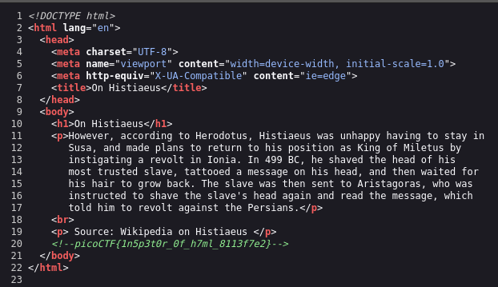

# Inspect HTML

flag: `picoCTF{1n5p3t0r_0f_h7ml_8113f7e2}`

My Approach to the problem
- opened the link and clicked on page source to see the html file where I was greeted by the flag
- 

What I learned through this challenge
- you can use 'view page source' to find clues within html files