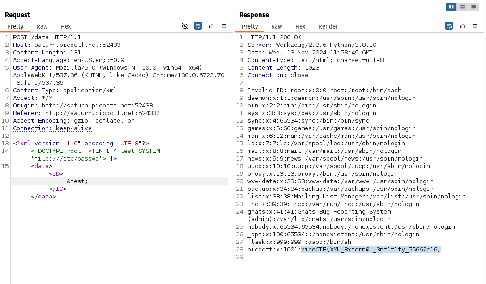

# dont use client side

flag: `picoCTF{no_clients_plz_b706c5}`
My Approach to the problem
- my 1st instinct when solving web exploitation problems is always to check the html codes
- 
- you can see script which checks for the password in the input space 
- if you rearrange it you will end up with picoCTF{no_clients_plz_b706c5}

What I learned through this challenge
- how to analyze javascript code