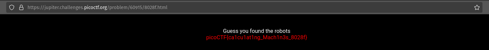
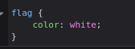

# where are the robots
flag: `picoCTF{ca1cu1at1ng_Mach1n3s_8028f}`
My Approach to the problem
- like always I searched the html files for hints but found nothing
- then I started googling about robots and files users dont what others to see and stumbled upon robots.txt
- I typed in the path https://jupiter.challenges.picoctf.org/problem/60915/robots.txt/8028f.html and was met with `User-agent: * Disallow: /8028f.html `
- I then went to that path and was greeted with the flag
- 

What I learned through this challenge
- what robots.txt files are
- robots.txt file is a text file that instructs web crawlers and other robots which parts of a website they can access. The file is created by the website owner and stored in the site's home directory.

Other incorrect methods I tried:

- trying to find a clue in the css files, there was a flag element in the stylesheet and assumed it can be accessed by changing the colors or maybe it was transparent 
- 