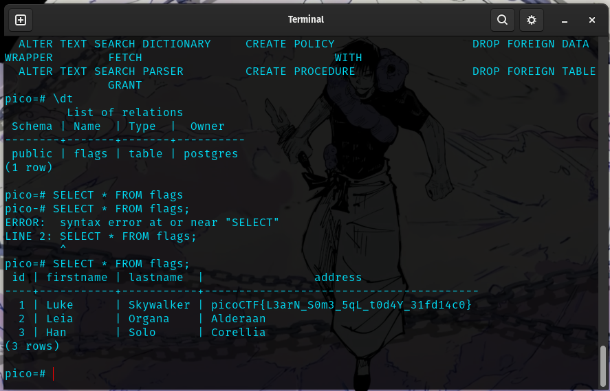

# SQL DIRECT

flag: `picoCTF{L3arN_S0m3_5qL_t0d4Y_31fd14c0}`

My Approach to the problem
- I connect to postgre sql database
- then use \h and \? to get any useful commands i can use
- use `\dt` which lists all the tables
- 
- then `SELECT * FROM flags` to see the contents

What I learned through solving this challenge:
- some basic SQL commands like \dt , SELECT etc

references:
- https://www.w3schools.com/sql/sql_syntax.asp