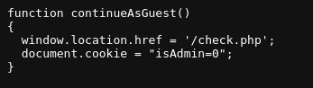
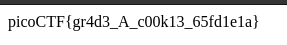

# power cookie

flag: `picoCTF{gr4d3_A_c00k13_65fd1e1a}`

My Approach to the problem:
- I inspected the page source and found guest.js script
- which contained this funciton: 
- so i intuitively assumed that `isadmin` had to equal to 1 for me to access the flag
- so intercepted the POST request using burp suite and changed it to `isAdmin=1` and forwarded it
- 