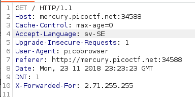
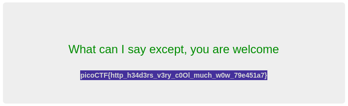

# who are you

flag: `picoCTF{http_h34d3rs_v3ry_c0Ol_much_w0w_79e451a7}`
My Approach to the problem
- using burp suite to intercept the get request and manipulate the browser, time,location,DNT to get to the flag
- 
- 