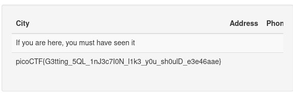

# more sqli

flag = `picoCTF{G3tting_5QL_1nJ3c7I0N_l1k3_y0u_sh0ulD_e3e46aae}`

My approach
- 
- the challenge begins on a website whose link is given
- we are greeted with a login screen
- this is where we inject our sql
- password: `admin' OR 1=1 --` when this is store in the database it will evaluate as True and `--` makes sure anything after that is invalid
- after that we are logged in
- we know for a fact the site is using SQlite
- so we use `efw' UNION SELECT name, sql, null from sqlite_master;--` to print all the tables in the site
- in short `UNION SELECT` is to access some data about the data sort of like metadata like tables, indexes stc
- im trying to retrieve `name` which is table
- `123' UNION SELECT flag, null, null from more_table;--`: The UNION keyword attempts to combine the original query results with new results from more_table
