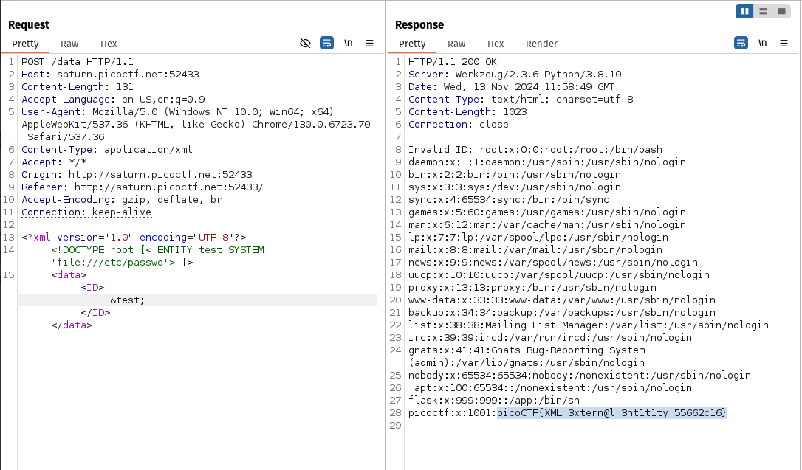

# SOAP
flag: `picoCTF{XML_3xtern@l_3nt1t1ty_55662c16}`
my approach to the problem
- so like always inspected the html to find something relevant, I found a js script named `detailscheckpayload.js`
- which means i have to inject some sort of payload , more specifically an XML payload
- XML allows documents to define `entities` which are external resources like files on a server
- if XML parser process external entities without restrictions, we can inject XML data containing references like in our case `/etc/passwd `file 
- so i defined a custom entity named test and reference is set to the /etc/passwd file so i cam access it
- 